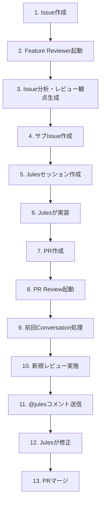

# cc-pulse PR Review Tools

cc-pulse開発を支援する自動化ツール群です。Issue起動からJulesによる実装、PR作成、自動レビュー、Julesによる修正までの全プロセスを自動化します。

## 全体フロー



### フェーズ詳細

#### Phase 1: Issue分析・レビュー観点生成

**トリガー:** Issue作成 (`.github/workflows/feature-reviewer.yml`)

**処理内容:**
1. 親Issueを取得
2. Claude AIでIssue内容を解析
3. Serena MCPでコードベース探索（最大7階層）
4. レビュー観点・テスト観点を生成
5. サブIssue作成（`[レビュー・テスト観点] 〇〇`）
6. **Google Julesセッション作成**（`automationMode: AUTO_CREATE_PR`）
7. 親Issueにコメント投稿（セッション情報をHTMLコメント形式で保存）

**関連ファイル:**
- `tools/feature-reviewer/` - Feature Reviewerツール
- [Feature Reviewer README](./feature-reviewer/README.md)

#### Phase 2: Julesによる実装

**トリガー:** Julesセッション作成

**処理内容:**
1. Julesがサブissueのレビュー観点を確認
2. 実装を開始
3. PR作成（親Issue参照: `Closes #123`）

**注意:**
- Julesは自動的にPRを作成します（`automationMode: AUTO_CREATE_PR`）
- PR本文に必ず親Issue参照（`Closes #123`）を含める必要があります
  - これにより、PR Review時に親IssueからJulesセッション情報を取得できます

#### Phase 3: PR自動レビュー

**トリガー:** PR作成・更新 (`.github/workflows/pr-review.yml`)

**処理内容:**

##### Phase 3.1: 前回Conversation処理
1. 前回のレビューコメント（`🤖 Auto-Review`マーク付き）を取得
2. 各Conversationの修正状況を判定:
   - **差分なし** → 催促コメント
   - **A: major_change** → クローズ
   - **B: todo_added** → クローズ
   - **C: not_resolved** → 再コメント
   - **D: has_replies** → オーナーメンション

##### Phase 3.2: 新規レビュー実施
1. PR差分を読み込み
2. **親Issueからレビュー観点を動的取得**（サブIssueの`<!-- REVIEW_GUIDELINES_START/END -->`ブロック）
3. 既存Conversationを収集（重複指摘防止）
4. Claude AIでレビュー実行
5. 新しい問題のみコメント投稿（全ての優先度）
6. サマリーコメント投稿

##### Phase 3.3: @julesコメント送信（Jules連携）
1. **親IssueからJulesセッション情報を取得**（`<!-- JULES_SESSION_NAME/URL -->`）
2. PRコメントを収集:
   - Issueコメント（PRコメント）
   - Pull Request Review Comment（インラインコメント）
3. **フィルタリング**:
   - ✅ `@jules`メンションを含む
   - ✅ 未解決（resolve済みでない）
   - ✅ **GitHub Actions Bot（`github-actions[bot]`）からのコメントのみ**
     - Jules自身のコメント除外（無限ループ防止）
     - 人間のコメント除外（二重送信防止、既にJulesセッション内で処理済み）
4. Julesセッションに送信（`sendMessage API`）

**関連ファイル:**
- `tools/pr-review/` - PR Reviewツール
- [PR Review README](./pr-review/README.md)

#### Phase 4: Julesによる修正

**トリガー:** @julesコメント受信

**処理内容:**
1. Julesがコメントを確認
2. 修正を実装
3. PRにpush
4. Phase 3（PR Review）が再実行される

**循環:**
- Phase 3 → Phase 4 → Phase 3 → ... （修正完了まで繰り返し）

## ツール構成

```
tools/
├── shared/                       # 共通処理
│   ├── claude/
│   │   └── agent.ts              # Claude Agent SDK wrapper
│   ├── github/
│   │   ├── issue-client.ts       # Issue操作専門
│   │   ├── pr-client.ts          # PR操作専門
│   │   ├── thread-resolver.ts    # Thread操作専門
│   │   └── guidelines-extractor.ts # レビュー観点・Jules情報抽出
│   └── constants.ts              # 共通定数
│
├── feature-reviewer/             # Phase 1: Issue分析
│   ├── README.md
│   ├── index.ts                  # エントリーポイント
│   ├── core/
│   │   ├── orchestrator.ts       # メインフロー制御
│   │   ├── analyzer.ts           # Issue・コード分析
│   │   └── jules-client.ts       # Jules API連携
│   ├── mcp/
│   │   └── feature-review-mcp-server.ts  # レビュー観点出力MCP
│   └── templates/                # コメントテンプレート
│
└── pr-review/                    # Phase 3: PR自動レビュー
    ├── README.md
    ├── index.ts                  # エントリーポイント（PR Review）
    ├── send-jules-comments.ts    # エントリーポイント（Jules Comment Handler）
    ├── core/
    │   ├── orchestrator.ts       # メインフロー制御
    │   ├── reviewer.ts           # レビュー実行（ClaudeAgent使用）
    │   ├── comment-resolver.ts   # コメント解決（ClaudeAgent使用）
    │   └── jules-comment-handler.ts  # @julesコメント処理
    ├── mcp/
    │   └── review-util-mcp-server.ts  # レビュー投稿MCP
    └── prompts/                  # プロンプトテンプレート
```

## 技術スタック

### 共通

- **Bun**: TypeScript実行環境
- **Claude Agent SDK**: AI駆動の分析・レビュー
- **Zod**: スキーマバリデーション
- **Octokit**: GitHub API クライアント

### Feature Reviewer

- **Serena MCP**: LSPベースのコードベース探索（最大7階層）
- **Google Jules API**: 自動実装セッション作成

### PR Review

- **Serena MCP**: LSPベースのコード解析
- **review-util MCP**: レビューコメント投稿
- **Google Jules API**: @julesコメント送信

## 環境変数

| 変数名 | 必須 | 説明 | 使用ツール |
|-------|------|------|-----------|
| `CLAUDE_CODE_OAUTH_TOKEN` | ◯ | Claude Pro/MAX OAuth token | 両方 |
| `GITHUB_TOKEN` | ◯ | GitHub Personal Access Token | 両方 |
| `JULES_API_KEY` | ◯ | Google Jules API Key | 両方 |
| `ISSUE_NUMBER` | ◯ | Issue番号（GitHub Actions自動設定） | Feature Reviewer |
| `PR_NUMBER` | ◯ | PR番号（GitHub Actions自動設定） | PR Review |
| `GITHUB_REPOSITORY` | ◯ | リポジトリ（owner/repo形式、GitHub Actions自動設定） | 両方 |
| `PR_AUTHOR` | △ | PR作成者（メンション用） | PR Review |
| `LOCAL_MODE` | △ | `true`でローカルモード（GitHub投稿なし） | 両方 |

### 環境変数の取得方法

```bash
# Claude OAuth Token（Pro/MAX推奨）
claude setup-token

# GitHub Token
# https://github.com/settings/tokens から作成
# 必要な権限: repo, workflow

# Jules API Key
# https://jules.google.com の Settings から作成
```

## ローカル実行

### Feature Reviewer

```bash
# Issue番号を指定して実行（mdファイルに保存）
bun run feature-review:local 8

# 出力先
tools/feature-reviewer/output/issue-8-guidelines.md
```

### PR Review

```bash
# PR番号を指定して実行（mdファイルに保存）
bun run review:local 8

# 出力先
tools/pr-review/output/pr-8-review.md
```

**ローカルモードのメリット:**
- ✅ GitHubに余計なコメントを投稿しない（テスト時に便利）
- ✅ 生成内容をすぐに確認できる
- ✅ mdファイルとして保存されるので再利用可能

## Google Jules連携の詳細

### Jules APIの役割

1. **Feature Reviewer**: 実装セッションを作成
2. **PR Review**: レビューコメントをセッションに送信

### 認証

- **ヘッダー**: `X-Goog-Api-Key`
- **API Key取得**: [Jules Web UI](https://jules.google.com) の Settings から作成
- **リポジトリ登録**: 事前にJules Web UIでリポジトリを登録する必要があります

### セッション情報の保存形式

Feature Reviewerが親Issueに投稿するコメント:

```markdown
✅ レビュー・テスト観点を作成しました #123

実装時は以下のIssueを参照してください：
- #123

<!-- JULES_SESSION_NAME: sessions/abc123 -->
<!-- JULES_SESSION_URL: https://jules.google.com/session/abc123 -->
```

PR Reviewは親IssueからこのHTMLコメントを抽出してJulesセッション情報を取得します。

### @julesコメントのフィルタリング

PR Reviewは以下のロジックで@julesコメントをフィルタリングします:

```typescript
// 対象: GitHub Actions Botからのコメントのみ
c.user === 'github-actions[bot]'

// 理由:
// 1. Jules自身のコメント除外（無限ループ防止）
// 2. 人間のコメント除外（二重送信防止、既にJulesセッション内で処理済み）
// 3. 自動レビューツールが生成した修正指示のみをJulesに送信
```

## トラブルシューティング

### "No parent issue reference found in PR"

**原因**: PR本文に親Issue参照（`Closes #123`）がない

**解決**: PR本文に必ず `Closes #123` を記載してください。

### "No Jules session found for this PR"

**原因**: 親IssueにJulesセッション情報がない

**解決**: 
1. Feature Reviewerが正常に実行されたか確認
2. 親Issueのコメントに `<!-- JULES_SESSION_NAME -->` があるか確認

### "Failed to send comments to Jules"

**原因**: Jules API Key が無効 or リポジトリが登録されていない

**解決**:
1. `JULES_API_KEY` が正しいか確認
2. [Jules Web UI](https://jules.google.com) でリポジトリを登録

## 開発ガイドライン

### 共通クライアントの使用

GitHub/Claude操作は必ず `tools/shared/` の共通クライアントを使用してください。

```typescript
// Issue操作
import { IssueClient } from '../shared/github/issue-client';
const issueClient = new IssueClient(octokit, owner, repo);

// PR操作
import { PRClient } from '../shared/github/pr-client';
const prClient = new PRClient(octokit, owner, repo);

// Thread操作
import { ThreadResolver } from '../shared/github/thread-resolver';
const resolver = new ThreadResolver(octokit);

// レビュー観点・Jules情報抽出
import { GuidelinesExtractor } from '../shared/github/guidelines-extractor';
const extractor = new GuidelinesExtractor(octokit, owner, repo);

// Claude Agent
import { ClaudeAgent } from '../shared/claude/agent';
const agent = new ClaudeAgent({ ... });
```

### ファイルサイズ制約

CLAUDE.mdの規約に従い、各ファイル300行以内を目標とする。

## 関連ドキュメント

- [Feature Reviewer詳細](./feature-reviewer/README.md)
- [PR Review詳細](./pr-review/README.md)
- [プロジェクトコーディング規約](../CLAUDE.md)
- [開発フロー](../docs/DEVELOPMENT.md)

## ライセンス

MIT
